# Testrapport Opdracht1 : Proefopstellingen netwerkapparatuur

(Een testrapport is het verslag van de uitvoering van het testplan door een teamlid (iemand anders dan de auteur van het testplan!). Deze noteert bij elke stap in het testplan of het bekomen resultaat overeenstemt met wat verwacht werd. Indien niet, dan is het belangrijk om gedetailleerd op te geven wat er misloopt, wat het effectieve resultaat was, welke foutboodschappen gegenereerd werden, enz. De tester kan meteen een Github issue aanmaken en er vanuit het testrapport naar verwijzen. Wanneer het probleem opgelost werdt, wordt een nieuwe test uitgevoerd, met een nieuw verslag.)

## Test X

Uitvoerder(s) test: NAAM
Uitgevoerd op: DATUM
Github commit:  COMMIT HASH

## Test basisconfiguratie

Uitvoerder: Emiel Marchand
Datum: 26/02/2018

Testrapport basisconfiguratie

A)

Terminal in Manager
1. Connectie met Room-145 is er
2. Warning banner staat er
3. Wachtwoord klopt
4. Priviliged wachtwoord klopt
5. show startup-config --> enable secret 5 $1$mERr$3VSsmT5sO0ky2/3RzW2XS1
6. Hostname is Room-145
7. Show running-config --> interface Vlan1 ip address 172.16.5.35 255.255.255.0
8. show startup-config = show running-config
Commandprompt in terminal
9. ipconfig --> klopt

Afbeeldingen:

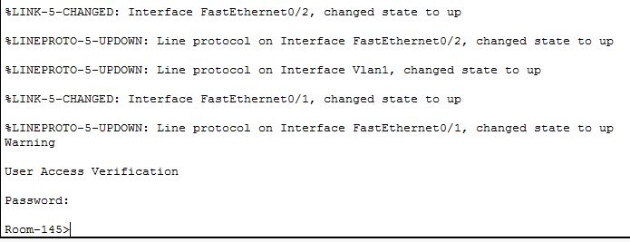

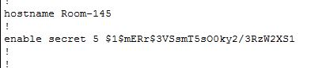

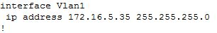

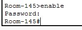

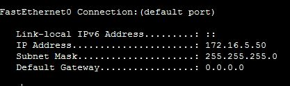

B)
Terminal in Manager
1. Connectie met Room-146 is er
2. Warning banner staat er
3. Wachtwoord klopt
4. Privileged wachtwoord klopt
5. show startup-config --> enable secret 5 $1$mERr$3VSsmT5sO0ky2/3RzW2XS1
6. Hostname is Room-146
7. show running-config --> interface Vlan1 ip address 172.16.5.40 255.255.255.0
8. show startup-config = show running-config
Commandprompt in terminal
9. ipconfig --> klopt

Afbeeldingen:

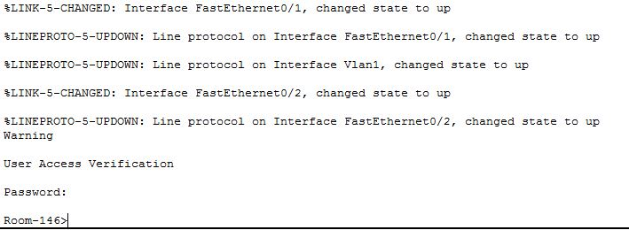

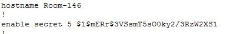

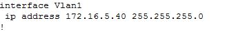

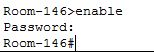

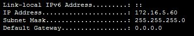

## Testrapport labo 1

A)

1. Cisco 2960 switch aanwezig
2. PC-PT aanwezig
3. RJ-45 Console kabel verbind switch en PC via COM-poort

Dit klopt allemaal zoals te zien op onderstaande afbeelding

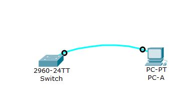

B) Switch:

1. Console van PC naar switch
2. Version : lanbasek9-mz.150-2.SE.
3. Clock settings: uur:min:sec maand dag jaar

Er is wel degelijk een verbinding van de pc tot de switch dit blijkt uit volgende afbeelding

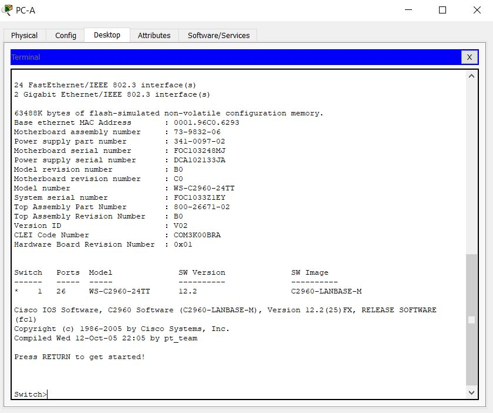

2 De versie is niet lanbasek9-mz.150-2.SE. maar C2960-LANBASE-M

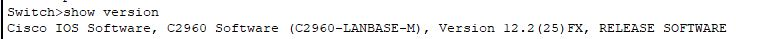

3. De instellingen van de klok kloppen ook zoals te zien in onderstaande afbeelding

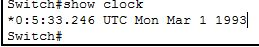

## Testrapport labo 2

### Switch 1

Er ligt een console kabel naar de switch vanaf PC A dit is te zien door via PC-B op de terminal van S1 te geraken. Als we hier op inloggen krijgen we een banner te zien en moeten we 2 keer inloggen zoals ingesteld dit klopt dus zoals te zien op de afbeelding. En ook dat de de hosntame van de switch S1 is.

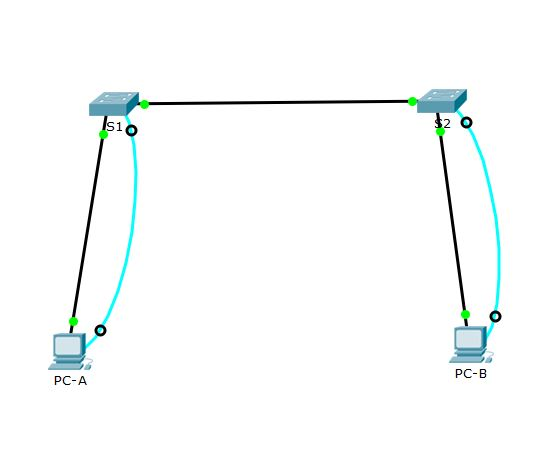

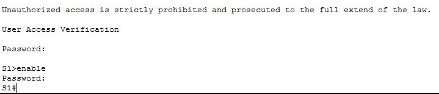

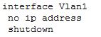

Als we naar de running config gaan van S1 via het commando `show runnning-config` krijgen we te zien dat de configuratie correct opgelsagen is en ook dat de wachtwoorden geëncrypteerd zijn.

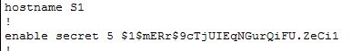

### Switch 2

Er ligt een console kabel naar de switch vanaf PC B dit is te zien door via PC-B op de terminal van S2 te geraken. Als we hier op inloggen krijgen we een banner te zien en moeten we 2 keer inloggen zoals ingesteld dit klopt dus zoals te zien op de afbeelding. En ook dat de de hosntame van de switch S2 is.

Als we naar de running config gaan van S2 via het commando `show runnning-config` krijgen we te zien dat de configuratie correct opgelsagen is en ook dat de wachtwoorden geëncrypteerd zijn.

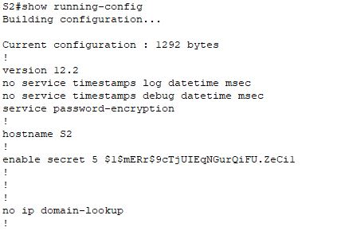

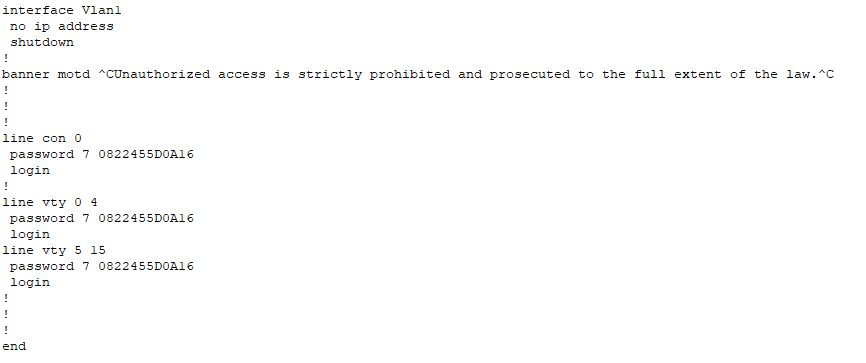
### PC-A

1. IP is 192.168.1.10
2. Subnetmask is 255.255.255.0
3. Hostname PC-B, kan je terugvinden in de instellingen van PC-A

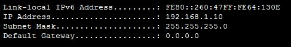

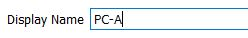

### PC-B

1. IP is 192.168.1.10 dit vinden we als we op de command prompt van PC-B het commando `ipconfig` gebruiken
2. Subnetmask is 255.255.255.0 dit vinden we als we op de command prompt van PC-B het commando `ipconfig` gebruiken

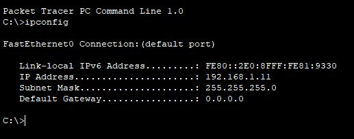

3. Hostname PC-B dit is te vinden in de instellingen van PC-B

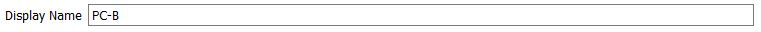

## Testrapport labo 3

### Router 1

De koperen crossover van R1 naar PC-B is er. Wanneer je kijkt naar de CLI van router 1, kan je zien dat er een banner is ingesteld.
Beide wachtwoorden kloppen. Wanneer met gaat kijken in de running-config met het commando `show running-config`, kan men de informatie i.v.m. de interfaces terugvinden. Met het commando `show clock` kan je de tijd terugvinden.

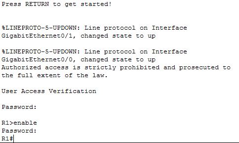

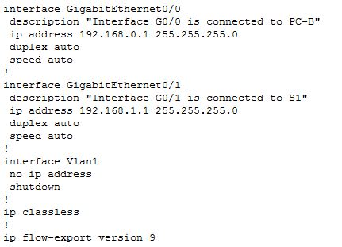

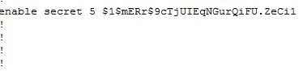

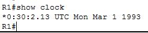

### PC A

1. IP is 192.168.1.3 dit vinden we als we op de command prompt van PC-B het commando `ipconfig` gebruiken
2. Subnetmask is 255.255.255.0 dit vinden we als we op de command prompt van PC-B het commando `ipconfig` gebruiken

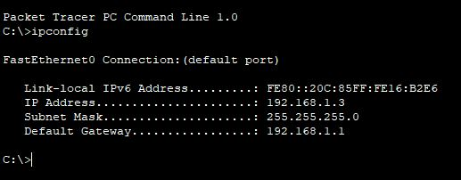

3. Hostname PC-A dit is te vinden in de instellingen van PC-A

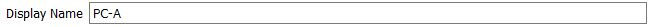
### PC B

1. IP is 192.168.0.3 dit vinden we als we op de command prompt van PC-B het commando `ipconfig` gebruiken
2. Subnetmask is 255.255.255.0 dit vinden we als we op de command prompt van PC-B het commando `ipconfig` gebruiken

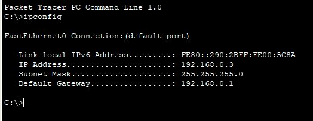

3. Hostname PC-B dit is te vinden in de instellingen van PC-B

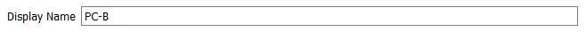

### Switch 1

De hostname van de switch klopt zoals te zien in de CLI, Vlan 1 is ook actief dit vind je via het commando `show vlan`

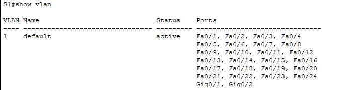

## Testrapport labo 4

## Switch R1

1. Secret wachtwoord is inderdaad class
2. De hostnaam van de switch is R1, dit is dus correct.

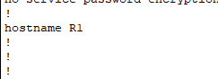

3. No ip domain-lookup is gëenabled

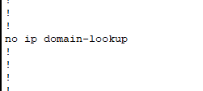

4. het line vty 0 15 password is password, dit komt overeen.
5. logging synchronous is op van line vty 0 15 en line con 0 gëenabled.

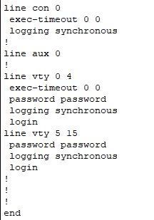

6. Het ip adres van interface F0/0 is ingesteld op 172.16.3.1 255.255.255.0
7. Shutdown is bij interface F0/0 gëenabled.
8. De description van interface F0/0 is "This is the description", dit is dus correct.

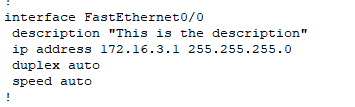

9. Interface S0/0/1 bestaat niet. Het is Serial2/0, het ip adres van Serial2/0 is 172.16.2.1 255.255.255.0
    a. Oplossing : Controleren naar juiste interface.
10. De clock rate van Serial2/0 is 64000, dit klopt dus.
11. Shutdown is bij interface Serial2/0 gëenabled.

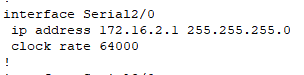

12. Ip route is 172.16.2.2 255.255.255.0 0.0.0.0 en niet 172.16.1.0 255.255.255.0 172.16.2.2
   a. Oplossing : Opletten bij het neerschrijven van het testplan. 
   
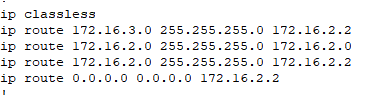
    
    
## Switch R2

1. Secret password is class, dit komt overeen met het testplan.
2. De hostnaam van de switch is R2, dit klopt.

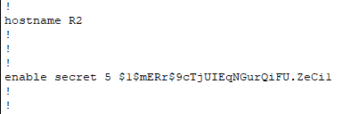

3. No ip domain-lookup vinden we terug in het running-config hiermee weten we dat dit is gëenabled.

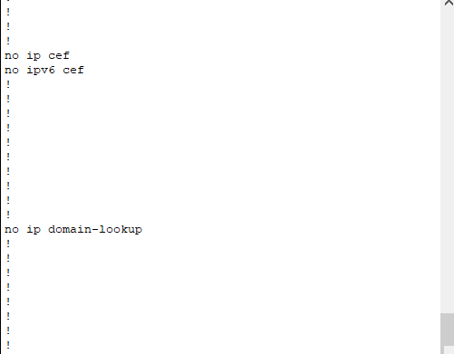

4. Het password van line vty 0 15 is inderdaad password.
5. Logging synchronous is op alle vty line ingesteld.

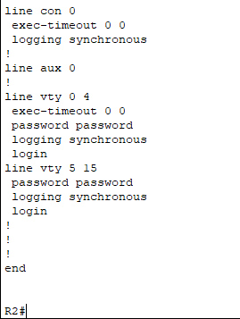

6. Interface F0/0 heeft als ip adres. 172.16.2.1 255.255.255.0
7. no shutdown is bij F0/0 aanwezig.
8. De description van F0/0 is "This is the description", dit klopt dus.

9. Er is geen interface Serial0/0/0, wel een interface Serial2/0 en heeft als ip adres 172.16.2.2 255.255.255.0
10. Er is geen interface Serial0/0/1, wel een interface Serial3/0 en heeft als ip adres 172.16.1.2 255.255.255.0
11. No shutdown is bij interface S2/0 en S3/0 ingesteld, dit kunnen we zien omdat er geen shutdown bij de interface te zien is.

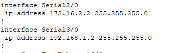

12. Volgende ip routes zijn vastgesteld.
    a. ip route 172.16.2.0 255.255.255.0 172.16.2.1 
    b. ip route 192.168.1.0 255.255.255.0 192.168.1.1 
    c. ip route 192.168.2.0 255.255.255.0 192.168.1.1 
    d. ip route 172.16.3.0 255.255.255.0 Serial2/0 
 13. Er is geen default route ingesteld. 
    Oplossing : Hier is geen default route nodig, dit kan niet.
    
 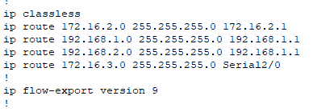

## Switch R3

1. Secret password is class, dit komt overeen met het testplan.
2. De hostnaam van de switch is R2, dit klopt.

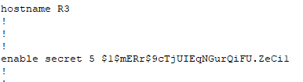

3. No ip domain-lookup vinden we terug in het running-config hiermee weten we dat dit is gëenabled.

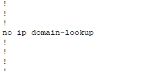

4. Het password van line vty 0 15 is inderdaad password.
5. Logging synchronous is op alle vty line ingesteld.

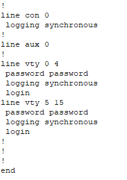

6. Interface F0/0 heeft als ip adres. 192.168.2.1 255.255.255.0
7. No shutdown is bij F0/0 aanwezig.
8. De description van F0/0 is "This is the description", dit klopt dus.

9. Er is geen interface Serial0/0/0, wel een interface Serial30 en heeft als ip adres 192.168.1.2
10. shutdown is bij interface S3/0 ingesteld, dit kunnen we zien omdat er geen shutdown bij de interface te zien is.
11. De clockrate van interface Serial3/0 is ingesteld op 64000.

11. Volgende ip routes zijn vastgesteld.
    a. ip route 192.168.1.0 255.255.255.0 192.168.1.2
    b. ip route 172.16.0.0 255.255.252.0 198.168.1.2
12. Er is geen default route ingesteld. 
    Oplossing : Instellen kan door het commando : ip route 0.0.0.0 0.0.0.0 192.168.1.2
    
 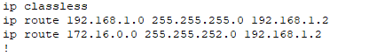

