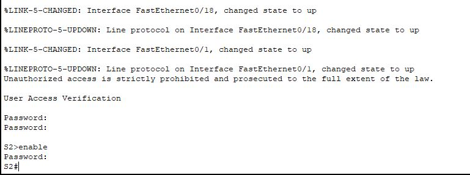

# Testrapport Opdracht1 : Proefopstellingen netwerkapparatuur

(Een testrapport is het verslag van de uitvoering van het testplan door een teamlid (iemand anders dan de auteur van het testplan!). Deze noteert bij elke stap in het testplan of het bekomen resultaat overeenstemt met wat verwacht werd. Indien niet, dan is het belangrijk om gedetailleerd op te geven wat er misloopt, wat het effectieve resultaat was, welke foutboodschappen gegenereerd werden, enz. De tester kan meteen een Github issue aanmaken en er vanuit het testrapport naar verwijzen. Wanneer het probleem opgelost werdt, wordt een nieuwe test uitgevoerd, met een nieuw verslag.)

## Test X

Uitvoerder(s) test: NAAM
Uitgevoerd op: DATUM
Github commit:  COMMIT HASH

## Test basisconfiguratie

Uitvoerder: Emiel Marchand
Datum: 26/02/2018

Testrapport basisconfiguratie

A)

Terminal in Manager
1. Connectie met Room-145 is er
2. Warning banner staat er
3. Wachtwoord klopt
4. Priviliged wachtwoord klopt
5. show startup-config --> enable secret 5 $1$mERr$3VSsmT5sO0ky2/3RzW2XS1
6. Hostname is Room-145
7. Show running-config --> interface Vlan1 ip address 172.16.5.35 255.255.255.0
8. show startup-config = show running-config
Commandprompt in terminal
9. ipconfig --> klopt

Afbeeldingen:

B)
Terminal in Manager
1. Connectie met Room-146 is er
2. Warning banner staat er
3. Wachtwoord klopt
4. Privileged wachtwoord klopt
5. show startup-config --> enable secret 5 $1$mERr$3VSsmT5sO0ky2/3RzW2XS1
6. Hostname is Room-146
7. show running-config --> interface Vlan1 ip address 172.16.5.40 255.255.255.0
8. show startup-config = show running-config
Commandprompt in terminal
9. ipconfig --> klopt

Afbeeldingen:

## Testrapport labo 1

A)

1. Cisco 2960 switch aanwezig
2. PC-PT aanwezig
3. RJ-45 Console kabel verbind switch en PC via COM-poort

Dit klopt allemaal zoals te zien op onderstaande afbeelding

B) Switch:

1. Console van PC naar switch
2. Version : lanbasek9-mz.150-2.SE.
3. Clock settings: uur:min:sec maand dag jaar

Er is wel degelijk een verbinding van de pc tot de switch dit blijkt uit volgende afbeelding

2 De versie is niet lanbasek9-mz.150-2.SE. maar C2960-LANBASE-M

3. De instellingen van de klok kloppen ook zoals te zien in onderstaande afbeelding

## Testrapport labo 2

### Switch 1

Er ligt een console kabel naar de switch vanaf PC A dit is te zien door via PC-B op de terminal van S1 te geraken. Als we hier op inloggen krijgen we een banner te zien en moeten we 2 keer inloggen zoals ingesteld dit klopt dus zoals te zien op de afbeelding. En ook dat de de hosntame van de switch S1 is.

Als we naar de running config gaan van S1 via het commando `show runnning-config` krijgen we te zien dat de configuratie correct opgelsagen is en ook dat de wachtwoorden geëncrypteerd zijn.

### Switch 2

Er ligt een console kabel naar de switch vanaf PC B dit is te zien door via PC-B op de terminal van S2 te geraken. Als we hier op inloggen krijgen we een banner te zien en moeten we 2 keer inloggen zoals ingesteld dit klopt dus zoals te zien op de afbeelding. En ook dat de de hosntame van de switch S2 is.

Als we naar de running config gaan van S2 via het commando `show runnning-config` krijgen we te zien dat de configuratie correct opgelsagen is en ook dat de wachtwoorden geëncrypteerd zijn.

### PC-A

1. IP is 192.168.1.10
2. Subnetmask is 255.255.255.0
3. Hostname PC-B, kan je terugvinden in de instellingen van PC-A

### PC-B

1. IP is 192.168.1.10 dit vinden we als we op de command prompt van PC-B het commando `ipconfig` gebruiken
2. Subnetmask is 255.255.255.0 dit vinden we als we op de command prompt van PC-B het commando `ipconfig` gebruiken

3. Hostname PC-B dit is te vinden in de instellingen van PC-B

## Testrapport labo 3

### Router 1

De koperen crossover van R1 naar PC-B is er. Wanneer je kijkt naar de CLI van router 1, kan je zien dat er een banner is ingesteld.
Beide wachtwoorden kloppen. Wanneer met gaat kijken in de running-config met het commando `show running-config`, kan men de informatie i.v.m. de interfaces terugvinden. Met het commando `show clock` kan je de tijd terugvinden.

### PC A

1. IP is 192.168.1.3 dit vinden we als we op de command prompt van PC-B het commando `ipconfig` gebruiken
2. Subnetmask is 255.255.255.0 dit vinden we als we op de command prompt van PC-B het commando `ipconfig` gebruiken

3. Hostname PC-A dit is te vinden in de instellingen van PC-A

### PC B

1. IP is 192.168.0.3 dit vinden we als we op de command prompt van PC-B het commando `ipconfig` gebruiken
2. Subnetmask is 255.255.255.0 dit vinden we als we op de command prompt van PC-B het commando `ipconfig` gebruiken

3. Hostname PC-B dit is te vinden in de instellingen van PC-B

### Switch 1

De hostname van de switch klopt zoals te zien in de CLI, Vlan 1 is ook actief dit vind je via het commando `show vlan`

