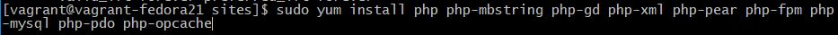

# Handleiding Drupal
Auteur(s): Jonas Braem

Voorgaande instructies voor LAMP: [LAMP](https://github.com/HoGentTIN/p2ops-g02/blob/master/opdracht02/LAMP/LAMP.md)
Gebruikte OS: Fedora Server

Het eerste wat we moeten doen is nog extra php modules downloaden die nodig zijn voor Drupal. Dit doen we met het commando `sudo yum -y install php-mbstring php-gd php-xml php-pear php-fpm php-mysql php-pdo php-opcache` 

