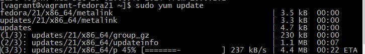
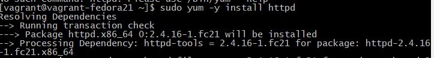
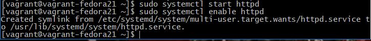
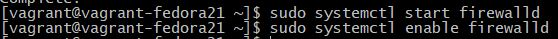

# Handleiding LAMP

Auteur(s): Jonas Braem

Gebruikte OS: Fedora Server

Voordat je deze handleiding gebruikt raad ik je aan om eerst volgend handleiding te gebruiken: [Vagrant Handleiding](https://github.com/HoGentTIN/p2ops-g02/blob/master/opdracht02/LAMP/Vagrant.md)

## Fedora Server

Als je de handleiding van de Vagrant al hebt gevolgd zou je al een minimale versie van Fedora Server moeten hebben geinstalleerd. En om deze te benaderen open je een Git bash in de map waar de vagrantfile zich bevind. Je voert dan het commando `Vagrant up` uit en daarna `Vagrant ssh`.

Eerst en vooral gaan we controleren of we wel de laatste versie van Fedora Server hebben door eens een update uit te voeren dit doen we via het commando `sudo yum -y update`. We zullen voor elk commando Sudo moeten gebruiken omdat we niet de rechten hebben van een administrator maar met Sudo wordt er ons wel meer toegelaten. En we gebruiken ook de -y optie om zo tegen alles ja te zeggen.

## LAMP

Het eerste deel van de LAMP is in orde ons Linux OS. Dan zullen we nu Apache installeren dit doe je met het commando `sudo yum -y httpd`

Nu gaan we de apache service starten en ook maken dat deze opstart bij het booten van de machine. Dit doen we met het commando `sudo systemctl start httpd` & `sudo systemctl enable httpd`

Nu gaan we de firewall configureren door deze ook te staren en te laten opstarten bij boot met de commando's `sudo systemctl start firewalld` & `sudo systemctl enable firewalld`

