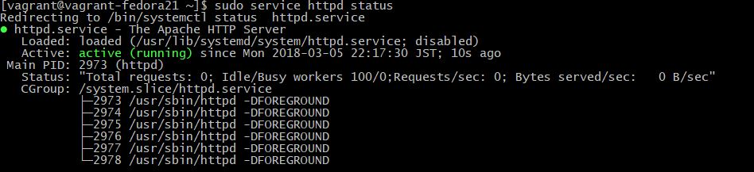
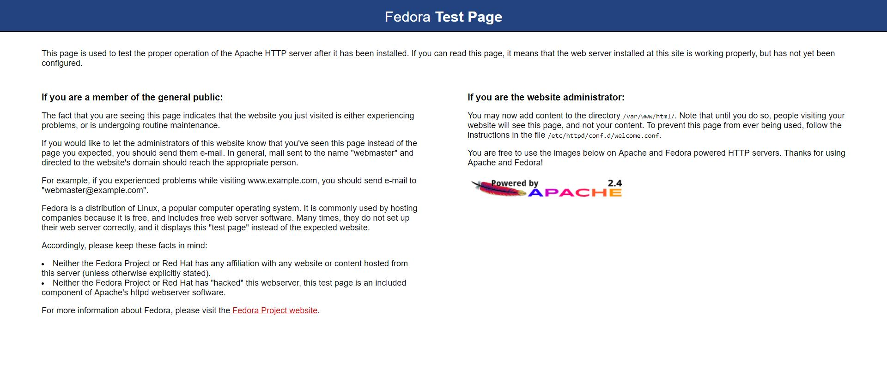
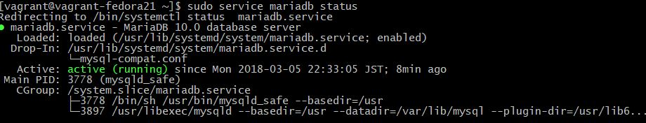

# Testplan Opdracht 2 LAMP:

## LAMP 
Auteur(s) testplan: [Jonas Braem](https://github.com/Braem53402)

### Apache

Om te testen of de Apache toepassing werkt en geinstalleerd is nemen we 2 stappen eerst maken we gebruik van het commando `sudo service httpd status` hiermee kunnen we bekijken of de service Apache actief is op de server. 

Om te testen of we onze server ook kunnen bereiken geeft apache bij de installatie ook een testpagina mee deze kan je bereiken door naar het ip adres van je server te surfen in dit geval was dat `192.168.33.11` maar dit kan bij jou anders zijn het adres naar waar je moet surfen is het geen dat jij aanduid in de vagrant file. Als je hier naar surft zou je deze pagina moeten krijgen.

### Maria DB

Om te testen of de Mariadb toepassing werkt en geinstalleerd is nemen we 2 stappen eerst maken we gebruik van het commando `sudo service mariadb status` hiermee kunnen we bekijken of de service Apache actief is op de server. 

### php

Om onze php te testen maken we gewoon een bestand aan in de map `/var/www/html` met het commando `sudo touch info.php`. In dit bestand zet je dan het volgende `<?php  phpinfo(); ?>` en daarna surf je naar je ip adres gevolgde door `/info.php`. Werkt dit dan krijg je dit te zien.

