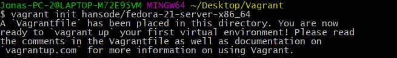

# Handleiding Vagrant
Auteur(s): Jonas Braem
Gebruikte tools: Vagrant & Git Bash

## Installatie van Git Bash
Als  werkomgeving heb ik Git Bash gebruikt dit kan je downloaden via volgende link [Git Download](https://git-scm.com/download)
## Installatie van Vagrant
Het besturingsysteem is gedowload via een Vagrant Share. Maar voordat we dit kunnen doen moeten we eerst vagrant downloaden die kan je via volgende link [Vagrant Download](https://www.vagrantup.com/downloads.html).
## Gebruik van Vagrant
Om te beginnen met een nieuwe VM in Vagrant is het handig om daar eerst een toegewezen map voor maakt zoals bijvoorbeeld bij mezelf het mapje LAMP is. Hier doe je een Git Bash. Nu gaan we een vagrant file toevoegen aan de map. Ik heb volgende box gebruikt [Fedora Server](https://app.vagrantup.com/hansode/boxes/fedora-21-server-x86_64) Om deze zijn vagrant file ook effectief toe te voegen gebruiken we volgend programma. `vagrant init hansode/fedora-21-server-x86_64 `.

Nu gaan we de VM booten hiervoor gebruik je het volgende commando `vagrant up`. Nu zal hij de VM installeren voor u. Dit kan natuurlijk even duren.

Eens dat de VM geinstalleerd is gaan we er mee connecteren via het commando `vagrant ssh`

Nu ben je op je virtueel machine zit kan je beginnen met de installatie van Lamp: [Lamp Handleiding](https://github.com/HoGentTIN/p2ops-g02/tree/master/opdracht02/LAMP)
