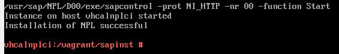
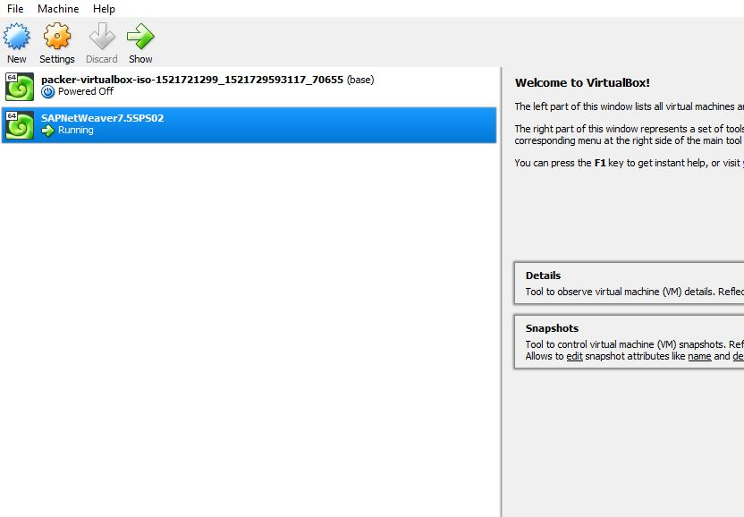
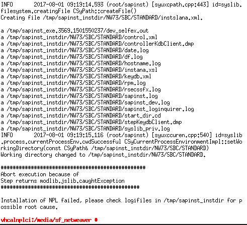

# Handleiding SAP

Auteur(s): Emiel Marchand 

Gebruikte OS: Host-pc: Windows 10 64-Bit, VirtualBox: openSUSE 64-Bit

## Inleiding

Dit is een handleiding die je kan volgen wanneer je met een vagrantscript een VirtualBox instantie kan installeren met [SAP NW AS ABAP 750 SP02 Developer Edition](https://blogs.sap.com/2016/11/03/sap-nw-as-abap-750-sp02-developer-edition-to-download/?preview_id=391853) .

Alles wordt voltooid aan de hand van Packer en Vagrant. Er wordt bij deze installatie geen proxy gebruikt. Alles is vrijwel automatisch behalve de daadwerkelijke commandos om de sap installatie te starten. Deze worden hier wel duidelijk beschreven.

## Benodigdheden

[Chocolatey](https://chocolatey.org/install)

Installeren met chocolatey: 
```
choco install -y git
choco install -y virtualbox
choco install -y vagrant
choco install -y packer
```

## Handleiding

Download [sap_netweaver_as_abap_750_sp02_ase_dev_edition.partX.rar](https://tools.hana.ondemand.com/#abap) en pak de bestanden uit in: *./sapinst*

**Packer** 

Laat het commando runnen tot op het einde! Hierna krijg je een .box bestand die je straks nodig hebt.
```
cd packer
cd openSUSE-42.1
$ packer build -only=virtualbox-iso template.json
```

**Vagrant**

```
cd ../../
vagrant up --provision
```

Wachten tot commando klaar is en dan:

```
vagrant reload
```

**Login**

Login --> vagrant/vagrant


Hierna gaan we navigeren naar de map met het SAP installatiescript

```
sudo -i
cd..
cd vagrant\sapinst
./install.sh
```

Accepteer de licentie en geef hetzelfde wachtwoord dat je net zelf hebt ingevoerd.

Succesvolle install:



**SAP starten**

```
su npladm
startsap ALL
```

De vbox can gestopt en gestart worden met volgende commandos:
```
vagrant up
vagrant halt
```
Of met virtualbox:



## Troubleshooting

Belangrijk! In geval dat je een error krijgt i.v.m de licentie moet je het 'dbexe.tgz-aa' bestand in de map "..\sapinst\server\TAR\x86_64" vervangen door het 'dbexe.tgz-aa' bestand uit volgende link:



[SAP Document center](https://mdocs.sap.com/mcm/public/v1/open?shr=dRhHsVYVLc5c1UDveogwtXBdL9m82JccRlvvBXO6K5Q)
