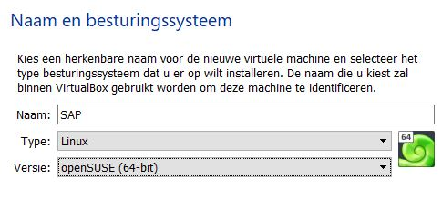

# Handleiding SAP

Auteur(s): Emiel Marchand 

Gebruikte OS: Host-pc: Windows 10 64-Bit, VirtualBox: openSUSE 64-Bit

## Stap 1: VirtualBox Configureren

Binnen virtualbox maak je een nieuwe virtuele machine. In de wizard selecteer je als type linux en versie openSUSE 64-Bit.
De naam kan je vrij kiezen.

