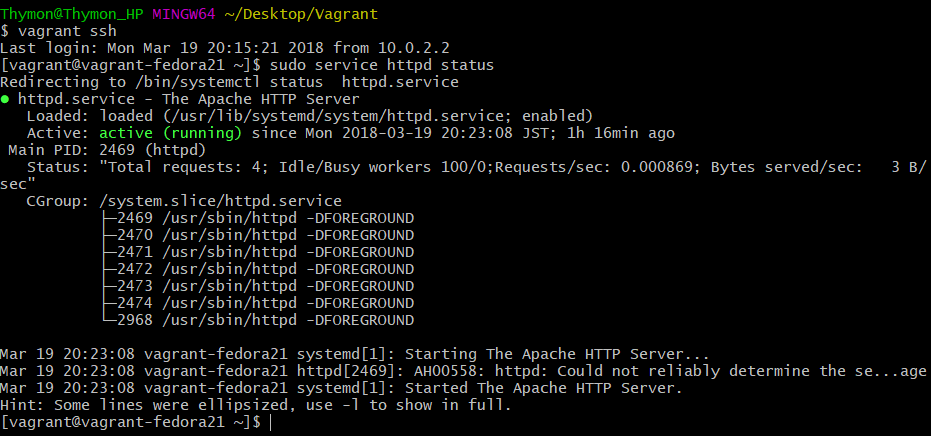
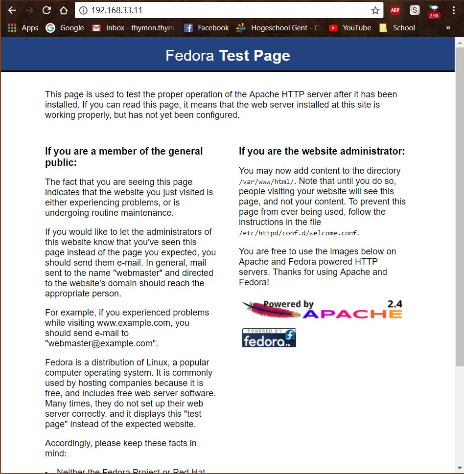
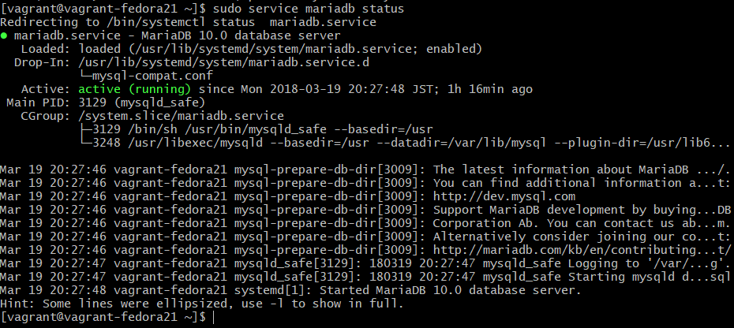
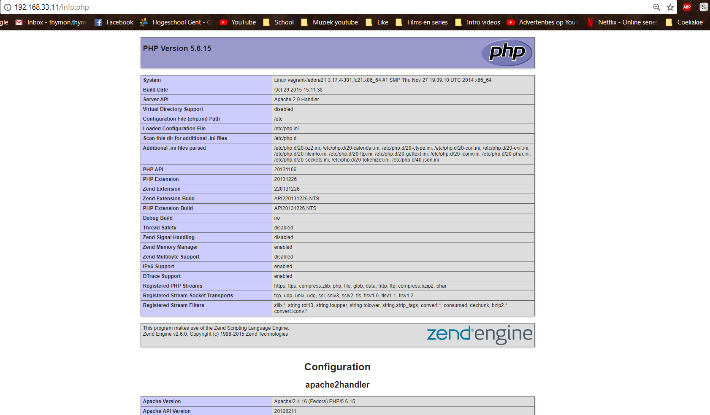

# Testrapport Opdracht 2 : WISA - LAMP - SAP

(Een testrapport is het verslag van de uitvoering van het testplan door een teamlid (iemand anders dan de auteur van het testplan!). 
Deze noteert bij elke stap in het testplan of het bekomen resultaat overeenstemt met wat verwacht werd. 
Indien niet, dan is het belangrijk om gedetailleerd op te geven wat er misloopt, wat het effectieve resultaat was, 
welke foutboodschappen gegenereerd werden, enz. De tester kan meteen een Github issue aanmaken 
en er vanuit het testrapport naar verwijzen. Wanneer het probleem opgelost werdt, 
wordt een nieuwe test uitgevoerd, met een nieuw verslag.)

## Test WISA

## Test SAP

## Test LAMP

## Vagrant Handleiding

Uitvoerder(s) test: Thymon Van Spaendonck
Uitgevoerd op: 19/03/2018

map aangemaakt /Desktop/Vagrant
git bash: cd ./Desktop/vagrant
#vagrant init hansode/fedora-21-server-x86_64
#vagrant up
#vagrant ssh
Controle laatste update:
-## sudo yum -y update
Vagrant-file: Guest aangepast 82 -> 8082

Lamp:
-## sudo yum -y install httpd
Gaf foutcode "HTTP Error 404"
Opgelost met:

  -## sudo yum clean all (hier ruimt men mee op en kan men de instalaltie verder zetten zonder "HTTP ERROR 404")

Begonnen op nieuwe pc
-->
BIOS aangepast op nieuwe pc naar "virtualization optie"

Volgens handleiding volgende commando's ingegeven

 vagrant init hansode/fedora-21-server-x86_64
- vagrant up
- vagrant ssh
Script gebruikt voor installaties: Script OK!

Handleiding in orde!

## TestRapport Vagrant
Uitvoerder: Thymon Van Spaendonck
Datum: 19/03/2018

APACHE:
1. #sudo service httpd status

2. surfen naar 192.168.33.11 cont

MARIADB:
3. ##sudo service mariadb satus

PHP:
4. Navigatie naar map: - cd /var/www/html

5. - sudo touch.info.php

6. - sudo yum install nano

7. - sudo nano info.php

8. In tekstEditor: <?php phpinfo(); ?>

9. - sudo systemctl restart httpd

10. surfen naar 192.168.33.11/info.php

