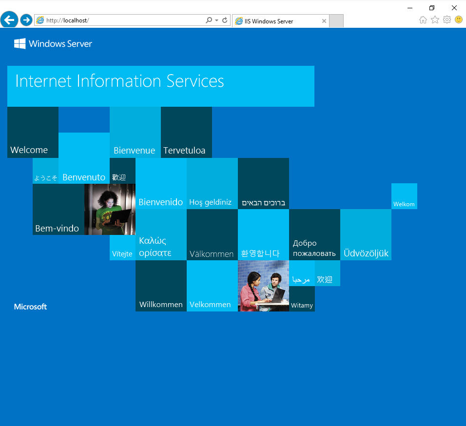

# Testplan Opdracht 2:

## WISA
 1. login wachtwoord: vagrant
 2. menory : 2048
 3. virtual name : Windows Server 2016
### script
1. module servermanager aanwezig/installeerd
2. module PackageManagement aanwezig/installeerd
3. Toestenbord instelling : Azerty Belgium
4. Chocolatey aanwezig op het systeem
5. Updates : apparataat up to date
6. klok : Huidige tijd
7. Internet is bruikbaar
8. Windowsfeature IIS aanwezig/installeerd
9. Windowsfeature HTTP aanwezig/installeerd
10. Windowsfeature ASP.net aanwezig/installeerd
11. SQLServer
  a. mssqlserver2014express aanwezig/installeerd
  b. sqlserver-cmdlineutils aanwezig/installeerd
  c. webdeploy aanwezig/installeerd
12. http://localhost ziet er als volgt uit : 

### vagrant
1. wisa script aanwezig in folder
2. Systeem wordt opgemaakt
3. script automatisch geladen
4. Wordt gecontroleerd op update 

#### vagrant file
1. config.vm.box = "mwrock/Windows2016"
2. config.vm.hostname = "host-win"
3. config.winrm.username = "Windows Server 2016"
4. config.winrm.basic_auth_only = true
5. config.vm.provision "shell", path: "WISA.ps1", privileged: true, binary: true
6. config.vm.box_check_update = true

### conclusie

## LAMP

## SAP
