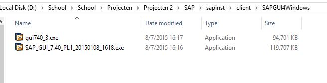

# Testplan Opdracht 2:

## WISA
Auteur(s) testplan: [Joeri Verhavert](https://github.com/joeriverhavert)

 1. wachtwoord: vagrant
 2. virtual name : Windows Server 2016
 
 ### vagrant
 1. We kunnen powershell connectie maken met de windows server.
 2. scriptje wordt zonder fouten gëinstalleerd.
 
### script

Vervolgens controleren we of volgende instellingen aanwezig zijn op het syteem.

1. We controleren of het toetsenbord op Azerty staat
2. Er moet gekeken worden of alle updates zijn uitgevoerd
3. De klok instellingen moeten op huidig uur staan.
4. Het internet moet raadpleegbaar zijn, hiermee bedoelen we dat er dus internet connectie is.
5. Volgende features moeten aanwezig zijn: 
    a. Windowsfeature IIS aanwezig/installeerd
    b. Windowsfeature HTTP aanwezig/installeerd
    c. Windowsfeature ASP.net aanwezig/installeerd
6. SQLServer moet running zijn op de virtual machine, hierdoor moet : 
  a. mssqlserver2014express aanwezig/installeerd zijn
  b. sqlserver-cmdlineutils aanwezig/installeerd zijn
  c. webdeploy aanwezig/installeerd zijn
7. Vervolgens controleren we of localhost is zoals op onderstaande foto

8. ASP.NET project kunnen we zonder fouten plaatsen in  C/:inetpub/wwwroot
9. Als we converteren naar application in iis zou ons project op localhost/"naam van het projcet" te zien zijn zoals onderstaande foto.

Opmerking : Het ASP.NET project dat ik u aanraad is BLOGSA.

10. ASAP.NET project heeft volledige schrijfrechten.
11. De connectie met de database is correct ingevoerd. Deze ingevoerde gegevens kunt u vinden op de deployement handleiding.
12. Als u zelfde resultaat heeft als onderstaande foto, dan werkt de database naar behoren.

### vagrant
Volgende instellingen moeten op de vagrantfile geïnitialiseerd zijn:
  1. config.vm.box = "JoeriVerhavert/Windows2016 ".
  2. config.vm.provision :shell, path: "WISA.ps1".
  3. config.vm.communicator = "winrm".

## LAMP 
Auteur(s) testplan: [Jonas Braem](https://github.com/Braem53402)

### Apache

Om te testen of de Apache toepassing werkt en geinstalleerd is nemen we 2 stappen eerst maken we gebruik van het commando `sudo service httpd status` hiermee kunnen we bekijken of de service Apache actief is op de server. 

Om te testen of we onze server ook kunnen bereiken geeft apache bij de installatie ook een testpagina mee deze kan je bereiken door naar het ip adres van je server te surfen in dit geval was dat `192.168.33.11` maar dit kan bij jou anders zijn het adres naar waar je moet surfen is het geen dat jij aanduid in de vagrant file. Als je hier naar surft zou je deze pagina moeten krijgen.

### Maria DB

Om te testen of de Mariadb toepassing werkt en geinstalleerd is nemen we 2 stappen eerst maken we gebruik van het commando `sudo service mariadb status` hiermee kunnen we bekijken of de service Apache actief is op de server. 

### php

Om onze php te testen maken we gewoon een bestand aan in de map `/var/www/html` met het commando `sudo touch info.php`. In dit bestand zet je dan het volgende `<?php  phpinfo(); ?>` en daarna surf je naar je ip adres gevolgde door `/info.php`. Werkt dit dan krijg je dit te zien.

## SAP
Auteur(s) testplan: [Emiel Marchand](https://github.com/RoyalSnail)

### SAP Logon

We zullen testen of we toegang hebben tot het SAP systeem. Dit doen we doormiddel van de software SAP LOGON.
Die kan je downloaden in de client folder.

Na installatie van de software maak je een nieuwe 'system entry'.

Druk op next en vul volgende gegevens in:

Druk nog 1 keer next en dan finish.
Dubbelklik op je system name uit de lijst en log in met username: Developer en wachtwoord: Appl1ance

