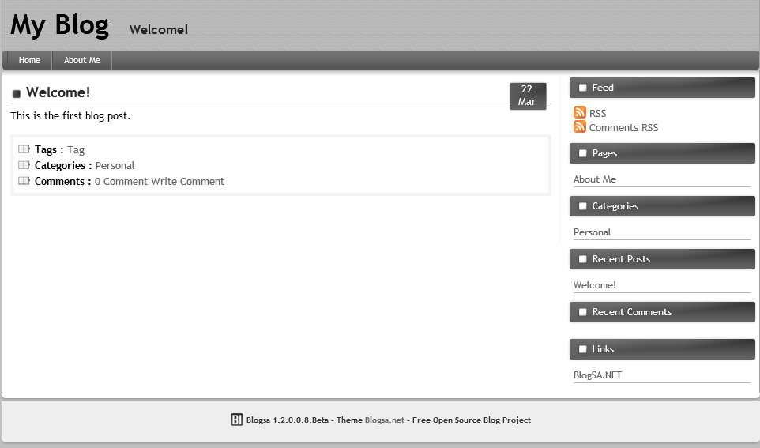

# Handleiding Convert to Application

Auteur(s): Joeri Verhavert

Gebruikte OS: Windows server 2016

Voor u deze handleiding raadpleegt, raden wij u aan om de vagrant en Wisa _Script handleiding te doornemen.

## Windows Server 
Ons werk zit er bijna op, wat ons nog rest te doen is het OpenSource ASP.NET project te gaan converteren naar een applicatie. Om dit op een correcte manier te voltooien, hebben wij een aantal stappen neergeschreven. Hierdoor is het voor u steeds gemakkelijk om tot een werkend resultaat te komen.

#### STAP 1 
Nadat uw OpenSource ASP.NET project hebt gedownload moeten hem unzippen, dit unzippen we in de map `C:\Inetpub\wwwroot`. Indien al gëupzipt hoef je enkel dit te kopieren in de `C:\Inetpub\wwwroot` folder.

!OPGELET : Sommige OpenSource ASP.NET bevatten verschillende folder met extra informatie. Dus let op goed welke folder u in de wwwroot unzipt! De folder die u nodig heeft bevat allerei aspx bestanden. 

#### STAP 2 
Eens de correcte folder in de wwwroot zit, kunnen we het `Internet Information Services(IIS)` in de server manager gaan openen.

#### STAP 3
Open het Sites en Open Default Web Site, als alles goed is verlopen zult u de folder daar terug vinden.

#### STAP 4
Het enige wat u nu nog moet doen om het OpenSource ASP.NET project te deployen is `convert to Application`. 

#### STAP 5
Ziezo, Ons project staat nu op de localhost of website, maar ons rest enkel nog het instellen en aanmaken van de database, dit kunnen we doen op de applicatie zelf.

#### STAP 6
Het aanmaken van de database met de juiste gebruiker doen we op de applicatie zelf. Deze login gegevens zijn : 
1. Server Address : .\SQLEXPRESS
2. Username : vagrant
3. Password : vagrant
4. Database Name : Blogsa
5. Secure connection niet aangevinkt

Als dit correct is ingevult zou uw pagina er zo moeten uitzien zoals op volgend foto. 

