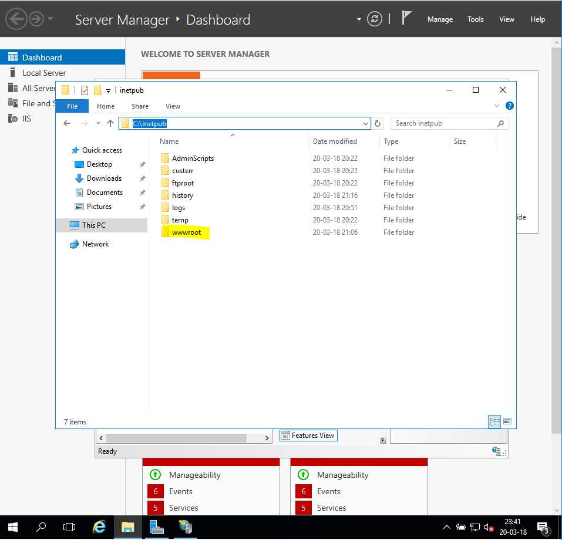

# Handleiding Convert to Application

Auteur(s): Joeri Verhavert

Gebruikte OS: Windows server 2016

Voor u deze handleiding raadpleegt, raad ik u aan op de vagrant en Wisa script handleiding te doornemen.

## Windows Server 
Ons werk zit er bijna op, wat ons juist nog te doen staat is het OpenSource ASP.NET project te gaan converteren naar een applicatie. Om dit op een correcte manier te voltooien, heb ik een aantal stappen neergeschreven. Hierdoor is het voor u steeds gemakkelijk om tot een werkend resultaat te komen.

#### STAP 1 
Nadat je een OpenSource ASP.NET project hebt gedownload moeten hem unzippen, dit unzippen we in de map C:\Inetpub\wwwroot.
!OPGELET : Sommige OpenSource ASP.NET bevatten verschillende folder met extra informatie, zoek dus goed naar de juiste folder!

#### STAP 2 
Eens de correcte folder in de wwwroot zit, kunnen we het Internet Information Services(IIS) in de server manager gaan openen.

#### STAP 3
Open het Sites en Open Default Web Site, als alles goed is verlopen zult u de folder daar terug vinden.

#### STAP 4
Het enige wat u nu nog moet doen om het OpenSource ASP.NET project te deployen is converten to Application. 

#### STAP 5
Als laatste stap rest ons enkel nog het instellen en aanmaken van de database, dit kunnen we doen op de applicatie zelf.

