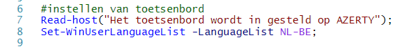
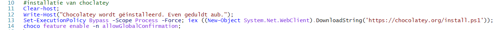
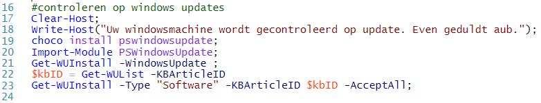
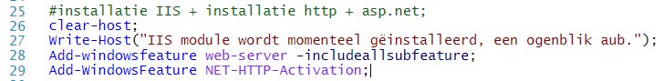
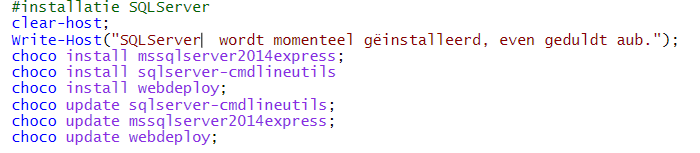

# Handleiding WISA

Auteur(s): Joeri Verhavert

Gebruikte OS: Windows server 2016

Voordat je deze handleiding gebruikt raad ik je aan om eerst WISA vagrant handleiding te gebruiken.

## Windows Server 

## WISA

In het eerste deel van het WiSA script worden de benodigde modules gëimporteerd. Om dit correct uit te voeren gebruiken we volgende commando's `Import-Module ServerManager`en `Import-Module PackageManagement`.

In het volgende stukje code wordt het systeem voorzien van een `AZERTT` toetsenbord. Dit verbeterd, maakt het proces sneller en gemakkerlijk om direct met het systeem te gaan werken. Het commando die ik hiervoor gebruikte is het volgende : `Set-WinUserLanguageList -LanguageList NL-BE`.

Vervolgens installeren we eerst chocolatey, dit maakt het efficiënter om programma's te gaan installeren. Hiervoor gebruikte ik het commando `Set-ExecutionPolicy Bypass -Scope Process -Force; iex ((New-Object System.Net.WebClient).DownloadString('https://chocolatey.org/install.ps1'))`.
Met dit commando gaan we chocolatey downloaden door gebruik te maken van een externe link.

Het volgende commando dat we gebruiken is `choco feature enable -n allowGlobalConfirmation`. Dit commando zorgt er voor dat er steeds geen bevestiging wordt gevraagd bij het downloaden.

We mogen zeker niet vergeten ons systeem te gaan controleren op update. Indien er nieuwe updates zijn moet het script het systeem voorzien van de nieuwe updates. Hiervoor moest het systeem verzien worden van `pswindowsupdate`,die we moesten downloaden van chocolatey. De commando's die nodig waren voor het systeem te update kunt u zien op volgende afbeelding.

Nu dat alle voorbereidingen zijn gedaan kunnen we ons systeem voorzien van het IIS feature samen met subfeatures zoals asp.net. Hiervoor gebruiken we het commando `add-windowsfeature web-server -includeallsubfeature`.

Als volgende stap installeren we het NET-HTTP-Activation module op ons systeem. `Add-WindowsFeature NET-HTTP-Activation` is hier het gepaste commando.

Als laaste zullen we de SQLServer gaan downloaden. Hiervoor zullen we dus weer gebruik maken van chocolatey om het proces efficiënter te maken.

Om SQLServer te installeren gebruiken we het commando `choco install mssqlserver2014express` en `choco install sqlserver-cmdlineutils`. Het systeem wordt dan voorzien van mssqlserver2014express en de sqlserver-cmd utilities.

Voor we ons visual studio applicatie kunnen deployen moeten het systeem voorzien van een webdeploy. We maken nogmaals gebruikt van chocolatey, het gebruikte commando is `choco install webdeploy`.

Als laaste stap vragen we om S`QLserver 2014 express` , `SQLsser-cmd utilities` en `webdeploy` te gaan update als zekerheid dat we de vernieuwde versie hebben. Hiervoor wordt het commando `choco update sqlserver-cmdlineutils` , `choco update mssqlserver2014express` en `choco update webdeploy` gebruikt.

