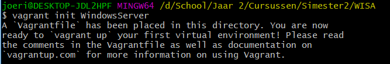
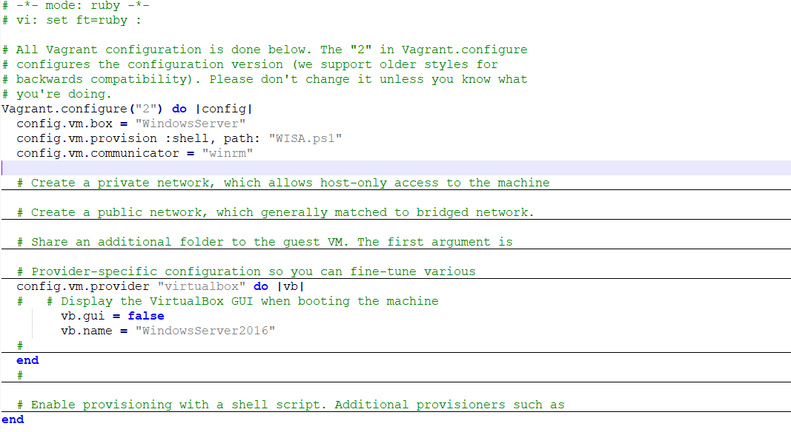
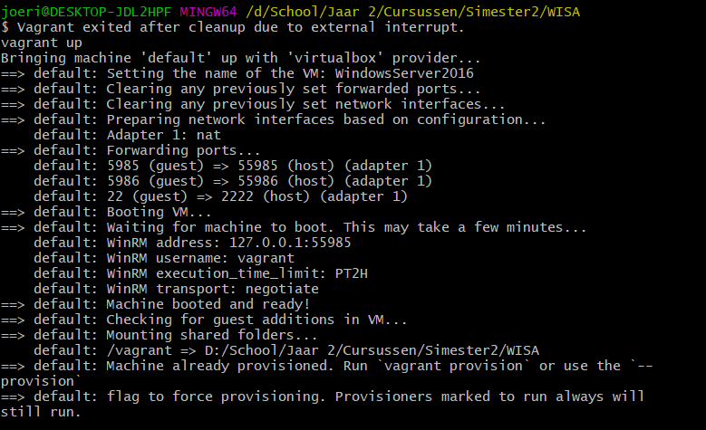
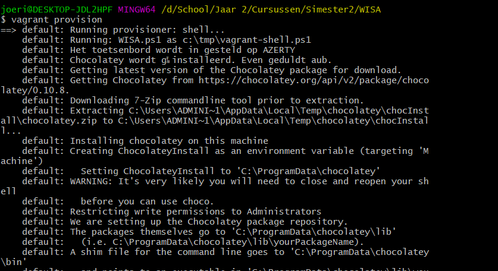

# Handleiding Vagrant
Auteur(s): Joeri Verhavert

Gebruikte tools: Vagrant & Git Bash

## Installatie van Git Bash
De werkomgeving die ik gebruikt heb is Git bash, dit programmma kan je downloaden om de volgende link : [Git Download](https://git-scm.com/download)

## Installatie van Vagrant

Voor we het besturingsysteem kunnen downloaden via een vagrant share moeten we eerst vagrant zelf downloaden, dit kan je downloaden via de volgende link: [Vagrant Download](https://www.vagrantup.com/downloads.html).

## Gebruik van Vagrant

Voor dat je begint met vagrant te werken is handig om eerst een toegewezen folder aan te maken waar je wenst in te werken met vagrant. Hier heb ik gebruikt gemaakt van het mapje `WISA`. In deze folder maak je gebruikt van de `git bash here`, hierdoor zit je met je git bash rechtstreeks in de juiste folder.

Als eerste stap ga je op zoek naar een windows server 2016 box op de vagrant cloud, ik heb hier gebruikt gemaakt van de
[/JoeriVerhavert/Windows2016](https://app.vagrantup.com/JoeriVerhavert/boxes/WindowsServer2016). Om deze toe te voegen aan je vagrant file gebruik je het commando
`vagrant init JoeriVerhavert/Windows2016`. Opgelet deze installatie kan een tijdje in beslag nemen!

Vervlogens moeten we er voor zorgen dat vagrantfile de juiste commmando's bevat. Want zonder de juiste commando's zal de vagrant niet degelijk werken. Indien u deze vagrantfile wenst te downloaden, raad ik u aan om deze te vervangen met de bestaande file. Als je de commando's wenst te noteren kan u volgende commando's vinden op onderstaande foto.

 ! Opgelet :  config.vm.box moet ingesteld worden op "JoeriVerhavert/Windows2016"!
 
[Vagrantfile downloaden](https://github.com/HoGentTIN/p2ops-g02/blob/master/opdracht02/WISA/Vagrantfile)

Voor we reeds verder kunnen is het natuurlijk belangrijk dat we over het scriptje beschikken, deze kan u downloaden op volgende link : [Windows Server 2016 Script Downloaden](https://github.com/HoGentTIN/p2ops-g02/blob/master/opdracht02/WISA/WISA.ps1). 

Als we nu het commando `vagrant up` gebruiken, gaat vagrant de virtual machine gaan booten. Dit betekent dat hij de virtual machine gaat gaan opzetten met de juiste settings die in de vagrantfile werden geinitialiseerd. 
Dit kan dan ook een tijdje duren, wees hier dus op voorbereid.

Als laaste hoeven we enkel het script te laten draaien op de virtual machine, het juiste commando dat we hiervoor gebruiken is `vagrant provision`. 
Door het script dat we geschreven hebben, zal de virtual machine met de juiste programma's en installaties voorzien worden. Op volgende foto is niet de volledige provision te zien. Doordat het script heel groot is, zijn er heel wat geschreven lijnen bij. Indien begin van provision overeen komt werkt dit zoals behoren.

Mededeling : ik raad u ook aan om de handleiding van ook eens te doornemen wisa script eens te doornemen.
