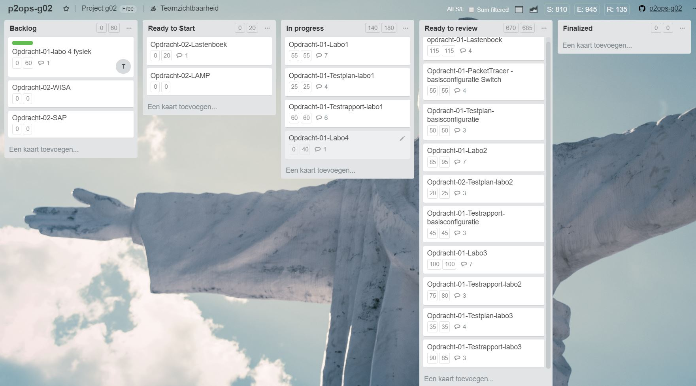

# Voortgangsrapport week nn

* Groep: g02
* Datum: 26/02/2018

| Student  | Aanw. | Opmerking |
| :---     | :---  | :---      |
| Joeri    |       |           |
| Thymon   |       |           |
| Jonas   |       |           |
| Emiem    |       |           |

## Wat heb je deze week gerealiseerd?

### Algemeen
#### Status kanban bord weekrapport 3.

* ...
* ...

#### Afbeelding tijdregistratie weekrapport 3

### Joeri
* ...

[Afbeelding individueel rapport tijdregistratie]

### Thymon

* ...

[Afbeelding individueel rapport tijdregistratie]

### Jonas

* ...

[Afbeelding individueel rapport tijdregistratie]

### Emiel

* ...

[Afbeelding individueel rapport tijdregistratie]

## Wat plan je volgende week te doen?

### Algemeen
### Student 1
### Student 2
### Student 3
### Student 4

## Waar hebben jullie nog problemen mee?

* ...
* ...

## Feedback technisch luik

### Algemeen

### Student 1
### Student 2
### Student 3
### Student 4

## Feedback analyseluik

### Algemeen

### Student 1
### Student 2
### Student 3
### Student 4

