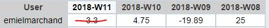

# Voortgangsrapport week 4

* Groep: g02
* Datum: 5/03/2018

| Student  | Aanw. | Opmerking |
| :---     | :---  | :---      |
| Joeri    |       |           |
| Thymon   |       |           |
| Jonas   |       |           |
| Emiem    |       |           |

## Wat heb je deze week gerealiseerd?

* 19-02 tot 26/02 
    * We hebben Labo 4 volledig fysiek uitgewerkt en afgewerkt en we zijn begonnen aan opdracht 2: Vagrant, WISA

### Algemeen
#### Status kanban bord weekrapport 4.

* ...
* ...

#### Afbeelding tijdregistratie weekrapport 4

Het deel dat doorkruist is, is van een week te ver doordat we weekrapport 4 te laat hebben ingevuld.

### Joeri Verhavert
#### Afbeelding tijdregistratie weekrapport 4
* ...

### Thymon

* ...

### Jonas

* ...

### Emiel

* ...

## Wat plan je volgende week te doen?

### Algemeen
### joeri : Wisa server opstellen 
### Jonas : Opdracht 2 LAMP server opstellen
### Emiel : SAP op Windows Server
### Thymon : Documentatie in orde brengen, hulp bieden bij anderen

## Waar hebben jullie nog problemen mee?

* Thymon, probleem dat pc de WISA server niet aan kan, dus niet veel werk kunnen doen aan die server.
* Veel opzoekingswerk door gebrek aan kennis van de te installeren en te gebruiken software

## Feedback technisch luik

### Algemeen

### Student 1
### Student 2
### Student 3
### Student 4

## Feedback analyse luik

### Algemeen

### Student 1
### Student 2
### Student 3
### Student 4

