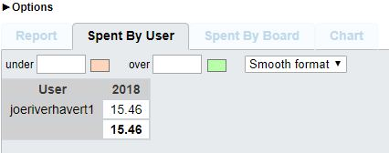
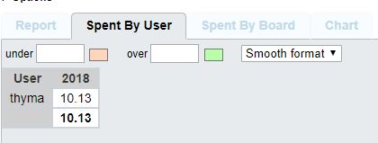
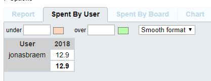
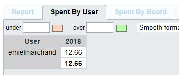

# Voortgangsrapport week 5

* Groep: g02
* Datum: 05/03/2018 - 12/03/2018

| Student  | Aanw. | Opmerking |
| :---     | :---  | :---      |
| Joeri    |       |           |
| Thymon   |       |           |
| Jonas   |       |           |
| Emiem    |       |           |

## Wat heb je deze week gerealiseerd?

* 05/03 - 12/03
    * Wisa Server is bijna af, nog een kleine fout die we proberen oplossen, documentatie verloopt geleidelijk met het oplossen van de vraag
    * Vagrant is ok, LAMP is ok, alleen nog documentatie moet geburen

### Algemeen
#### Status kanban bord weekrapport 5.

* ...
* ...

#### Afbeelding tijdregistratie weekrapport 5

### Joeri Verhavert
#### Afbeelding tijdregistratie weekrapport 5
* ...

### Thymon

* ...

### Jonas

* ...

### Emiel

* ...

## Wat plan je volgende week te doen?

### Algemeen
### joeri : WISA Server problemen oplossen om dit af te ronden
### Jonas : LAMP afwerken en documenteren
### Emiel : SAP op Windows Server afwerken en documenteren
### Thymon : Documentatie in orde brengen, Testen Vagrant + LAMP

## Waar hebben jullie nog problemen mee?

* ...
* ...

## Feedback technisch luik

### Algemeen

* [linkje naar PowerShell Windows Update](https://gallery.technet.microsoft.com/scriptcenter/2d191bcd-3308-4edd-9de2-88dff796b0bc)

### Emiel 
### Joeri
### Jonas
### Thymon

## Feedback analyse luik

### Algemeen

### Emiel 
### Joeri
### Jonas
### Thymon

