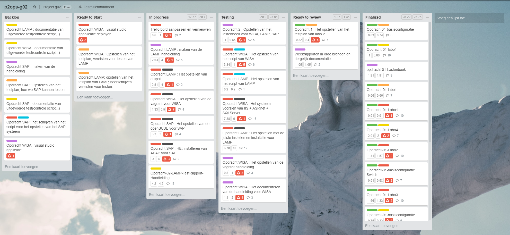
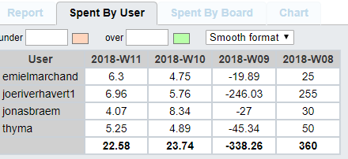
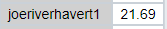
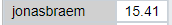
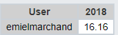
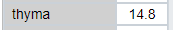

# Voortgangsrapport week 6

* Groep: g02
* Datum: 12/03/2018 - 19/03/2018

| Student  | Aanw. | Opmerking |
| :---     | :---  | :---      |
| Joeri    |       |           |
| Thymon   |       |           |
| Jonaas   |       |           |
| Emiem    |       |           |

## Wat heb je deze week gerealiseerd?

* Verder gewerkt aan opdracht 2
* 
* 

### Algemeen

* ...
* ...

### Joeri

* ...

### Jonas

* LAMP Setup, Documentatie en testplan afgemaakt.

### Emiel

* ...

### Thymon

* Verder zoeken op fouten installatie HTTPD vagrant, nieuwe pc gekocht, opnieuw begonnen en nieuwe fouten proberen oplossen
* Documentatie in orde brengen

## Wat plan je volgende week te doen?

### Algemeen
### Emiel: 
### Joeri: afwerken wisa
### Jonas: Drupal setup afmaken en hier documentatie & testplan van opstellen
### Thymon: Vagrant TestRapport afwerken na oplossing voor fouten ivm met installaties en inloggen op vagrant gevonden te hebben.

## Waar hebben jullie nog problemen mee?

* Bij het testRapport, testen van de de vagrant handleiding, kom ik(Thymon) op een fout terecht als ik het commando "vagrant ssh"
  invoer, volgende foutcode kom tevoorschijn "ssh_exchange_identification read connection reset by peer". Hierdoor kan ik niet verder     met de komende installaties en dergelijke testing.
* ...

## Feedback technisch luik

### Algemeen

### Emiel: 
### Joeri: 
### Jonas: 
### Thymon: 

## Feedback analyse luik

### Algemeen

### Emiel:  
### Joeri: 
### Jonas: 
### Thymon: 

